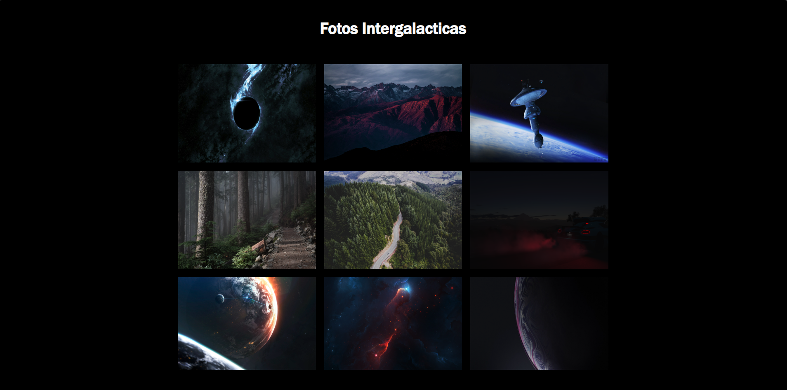

# Galeria de Fotos

Este é um projeto simples de uma galeria de fotos interativa, desenvolvido com React e TypeScript. O objetivo é mostrar uma coleção de imagens com funcionalidade de visualização.

## Tecnologias

- **React**
- **TypeScript**

## Screenshot

## Acesso em:
https://arley0122.github.io/GaleriaDeFotos/
